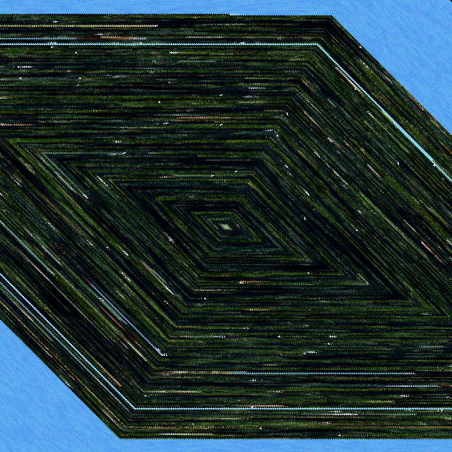

# Cubsim

Can a non-random [Markov chain](http://en.wikipedia.org/wiki/Markov_chain) produce interesting works of art when seeded with Instagram photos?

## [Photo One](./photo-one)

* Pattern: Fork
* Filter: 16 bit color
* Pixel picking process: least blue

